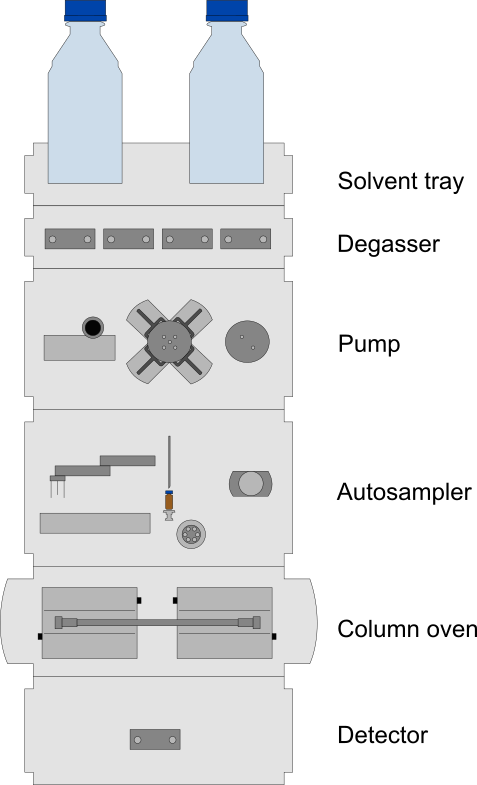

# High Performance Liquid Chromatography

HPLC is used to separate, identify and quantify one or more analytes.

[Separation](../methods-of-separation.md) is achieved by specific interaction of the analyte with the [mobile phase](./#mobile-phase) and [stationary phase](./#stationary-phase). The more an analyte favours interaction with the stationary phase over the mobile phase, the greater its [retention time](../system-suitability.md#retention-time), and vice versa.

## Instruments Components

### Solvent tray

See [Mobile Phase (eluent)](method-development.md#mobile-phase-eluent)

Holds bottles of mobile phase, and catches drips.

.png>)

### Degasser

Removes dissolved gas and small air bubbles from mobile phase. Gas can interfere with analysis and damage some components of the instrument.

.png>)

### Pump

Controls the flow and composition of mobile phase.

**Pump head/drive:** Pumps mobile phase at a constant flow rate.

**Multi channel gradient valve:** Mixes solvents from different lines at a ratio defined by the user.

**Damper:** Smooths the flow of mobile phase.

**Purge valve:** Redirects flow from autosampler (closed) to waste (open). Opened when cleaning or removing air bubbles from solvent lines.

### Autosampler

**Gripper arm:** Transfers **sample vial** from **vial tray** to needle seat

**Switching valve:** Redirects flow coming from pump to either the metering device, sample loop, and needle (mainpass) or the column (bypass)

**Metering device:** Draws sample from the sample vial into the **needle**/**sample loop**

**Needle seat:** Houses the needle and completes the liquid path while the instrument is in mainpass mode.

### Column oven

See [Stationary Phase (column)](method-development.md#stationary-phase-column)

Holds the column and maintains a temperature set by the user

.png>)

### Detector

See [Methods of Detection](../methods-of-detection.md)

.png>)
