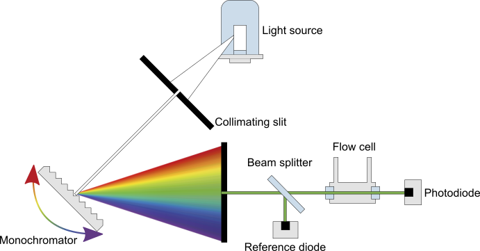
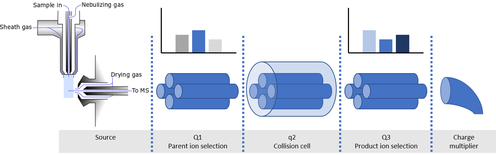
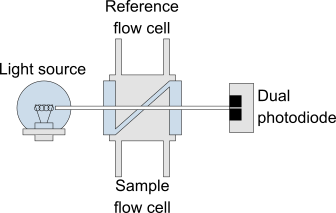
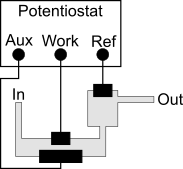
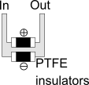

# Methods of Detection

\*Schematics omit components such as lenses, while vital for the detector they are not required for understanding the detection principle.

$$LOD = C*V*Mw$$

Where:

* $$LOD$$ = Limit of detection ($$g$$)
* $$C$$ = Concentration ($$mol/L$$)
* $$V$$ = Injection volume ($$L$$)
* $$Mw$$ = Molecular weight ($$g/mol$$)

## UV-Vis Absorbance

### Variable Wavelength

The Variable wavelength detector (VWD) is one of the most common HPLC detectors. The [monochromator ](../spectroscopy/#monochromator)provides a light of a user specified wavelength (often 190-900 nm), which passes to a beam splitter, one beam is directed to a reference diode and the other to the flow cell. The light that reaches the photodiode is attenuated by the sample in the slow cell, and the signal is reported relative to the reference diode.

**Applications:** Routine analysis. Most common choice of detector

**Requirements:** Analytes with a chromophore in the UV-Vis range

**LOD:** $$\sim10\ pg$$

**Detector parameters:**

* **Wavelength (nm):** The detection wavelength

### Diode Array

The diode array detector (DAD) is capable of providing the same data as a VWD, however, instead of monitoring a single wavelength, a DAD is capable of monitoring multiple or a range of wavelengths. The whole spectrum of light is passed through the flow cell, and the attenuated beam is directed to a diffraction grating which focuses the spectrum onto a diode array.

**Applications:** Multiple compounds with non-overlapping absorbance bands. Peak purity analysis&#x20;

**Requirements:** Analytes with a chromophore in the UV-Vis range

**LOD:** $$\sim10\ pg$$

**Detector parameters:**

* **Wavelength(s) or range (nm):** The detection wavelength. Can be single, multiple, or a range

.png>)

## Fluorescence

The fluorescence detector (FLD) is orders of magnitude more sensitive than UV-Vis absorbance detectors but is limited to analytes containing a **fluorophore**. One monochromator is employed to generate an **excitation** source of a single wavelength, this beam passes into the flow cell where the analyte fluoresces. Fluoresced light is passed to a second monochromator to filter out a single **emission** wavelength.

**Applications:** Samples which require high selectivity and /or specificity. Commonly used for amino acids, and vitamins

**Requirements:** Analyte must contain or be derivatized with a fluorophore

**LOD:** $$\sim10\ fg$$

**Detector parameters:**

* **Excitation wavelength (nm):** The wavelength used to excite the sample, should be chosen based on the fluorescence profile of the analyte.
* **Emission wavelength (nm):** The detection wavelength, should be chosen based on the fluorescence profile of the analyte.

.png>)

## Mass Spec

In principle, LC can be used as the [sample introduction](../mass-spectrometry/sample-introduction.md) for any mass spectrometer [ionization method](../mass-spectrometry/ionization-methods.md) and [mass analyser](../mass-spectrometry/mass-analyzers.md). One of the most common setups is [electrospray ](../mass-spectrometry/ionization-methods.md#electrospray-esi)coupled with a [triple quadrupole](../mass-spectrometry/mass-analyzers.md#quadrupole) detector, shown here.

**Applications:**

**Requirements:**

**LOD:** $$\sim1\ pg$$

**Source parameters:**

* **Sheath gas temp (**$$\degree C$$**):**&#x20;
* **Sheath gas flow (L/min):**
* **Nebulizer (psi):**
* **Capillary (V):**
* **Nozzle (V):**
* **Drying gas temp (**$$\degree C$$**):**
* **Drying gas flow (L/min):**

**Detector parameters:**

* **Fragmentor (V):**
* **Collision energy (V):**
* **Cell accelerator (V):**
* **Polarity (positive/negative):**

## Refractive Index

Measures the difference in refractive index between the reference flow cell (pure eluent) and the sample flow cell (eluent + sample). This is achieved by recording the difference in signal intensity between two photodiodes as the beam is refracted to a greater or less extent by the sample.

**Applications:** A 'universal detector'. Often used in combination with GPC

**Requirements:**

**LOD:** $$\sim1\ ng$$

## Light Scattering

**Applications:**

**Requirements:**

**LOD:** $$\sim1\ \mu g$$

## Evaporative Light Scattering

**Applications:**

**Requirements:**

**LOD:** $$\sim1\ \mu g$$

**Detector parameters:**

* **Evaporator temp (**$$\degree C$$**):** Temperature of the evaporator tube. Must be high enough to fully evaporate all solvent but not too high or may result in low sensitivity.
* **Nebulizer temp (**$$\degree C$$**):** Temperature of the nebulizer.
* **Gas flow (L/min):** The evaporator gas flow. Determined mostly by the solvent. Generally, inversely proportional to the evaporator temperature.

.png>)

## Electrochemical

**Applications:**

**Requirements:**

**LOD:** $$\sim100\ pg$$

## Conductivity

**Applications:**

**Requirements:**

**LOD:** $$\sim100\ pg$$

