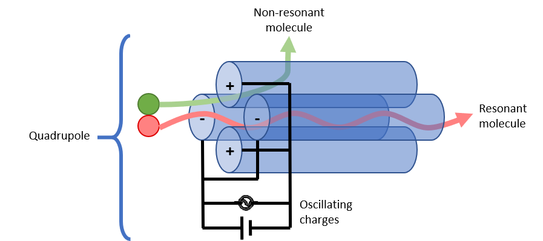

# Mass Analyzers

### Magnetic or Electric Sectors

**Mass range:** $$0.1-10\ kDa$$

### Quadrupole

**Mass range:** $$0.05-10\ kDa$$

### Ion Trap

**Mass range:** $$0.05-100\ kDa$$

### Time-of-Flight (ToF)

**Mass range:** $$0.1-100\ kDa$$

### Fourier Transform Ion Cyclotron Resonance (FT-ICR)

**Mass range:** $$0.1-10\ kDa$$

