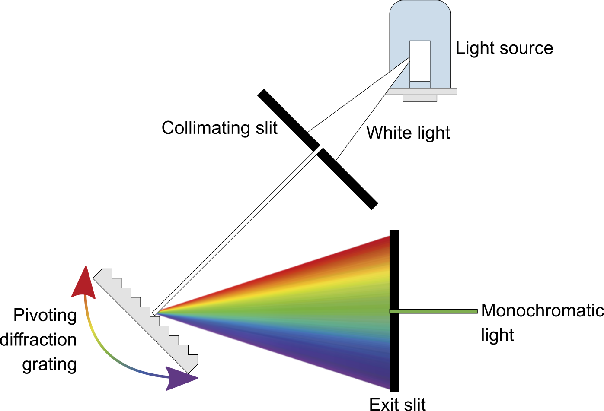
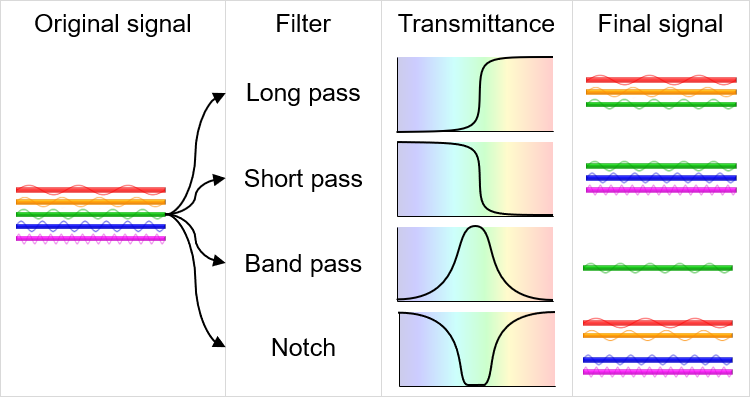

# Spectroscopy

.png>)

## Electromagnetic radiation

.png>)

## Units

.png>)

$$E=\frac{hc}{\lambda}=hf$$

Where:

* $$E$$ = Energy of photon ($$eV$$ or $$J$$)
* $$h$$ = Planck constant ($$4.13E^{-15}\ eV$$or $$6.62E^{-34}\ J$$)
* $$c$$ = Speed of light in a vacuum ($$299,792,458\ m/s$$)
* $$\lambda$$ = Wavelength of photon ($$m$$)
* $$f$$ = Frequency of photon ($$Hz$$)

## Instrument Components

### Source

### Slits

### Monochromator

### Detector

### Filter

