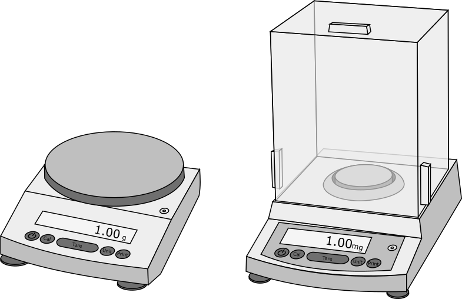
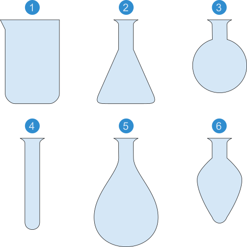
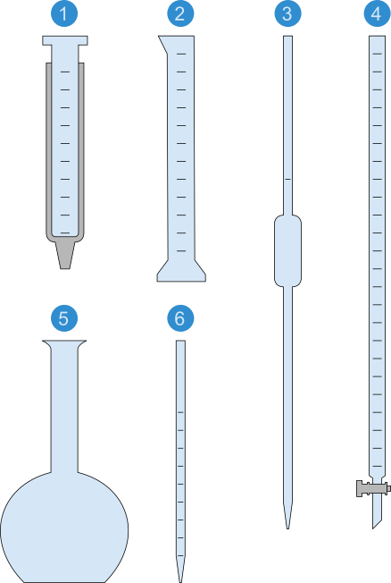
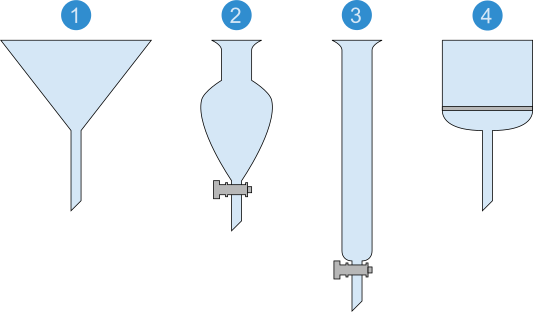

# Basic Equipment

## Balance

Used to weigh out an accurate mass of a substance.

### Procedure

* Check the substance being weighed out, it should be room temperature and dry.
* Check the environment, there should be no air currents, vibrations, or temperature variations.
* Tare the balance with the receiving vessel, display should read '0'.
* Weigh out substance and record the value once the reading has stabilized several seconds.
* Remove the receiving vessel and ensure that the display returns to '0'.

## pH Meter

Used to measure the pH of a solution.

### Procedure

* Ensure that the pH meter is calibrated by measuring the pH of a reference buffer.
* Rinse the probe with distilled water.
* Place the probe into test solution, ensuring the reference junction is submerged, and allow reading to stabilize.
* Rinse the probe with distilled water.
* Place the probe into storage solution.

<figure><figcaption></figcaption></figure>

<figure><figcaption></figcaption></figure>

## Micropipettes

Used to measure out an accurate volume of a solution.

### Procedure

* Set the volume by turning the volume adjustment knob, never exceed the maximum volume for the pipette.
* The reading of volumeter display depends on the maximum volume of the pipette, e.g. on a p200 the maximum volume is 200$$\mu L$$and the first value on the display is equal to 100s of $$\mu L$$s.
* Depress the plunger to the first stop to expel air from the pipette.
* Keeping the pipette upright, draw liquid into the pipette tip by slowly releasing the plunger. You may need to aspirate several times if working with volatiles.
* Depress the plunger to the second stop to expel liquid from the pipette.

<figure><figcaption></figcaption></figure>

## Glassware

### Vessels

1. Beaker
2. Conical (Erlenmeyer) flask
3. Round-bottomed flask
4. Test tube
5. Evaporating flask
6. Pear-shaped flask

### Volumetric

1. Gas syringe
2. Graduated cylinder
3. Volumetric pipette
4. Burette
5. Volumetric flask
6. Graduated pipette

### Separation

1. Filter funnel
2. Separating funnel
3. Chromatography column
4. Sintered glass filter

### Miscellaneous

1. Dropping funnel
2. Straight (Liebig) condenser
3. Distilling column
4. Side-arm (Buchner) flask

